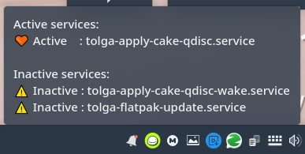
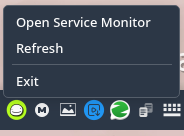
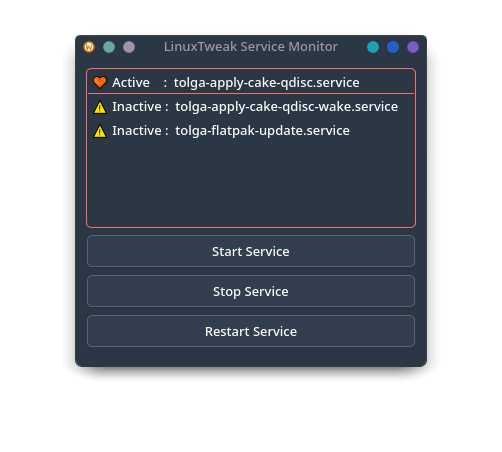
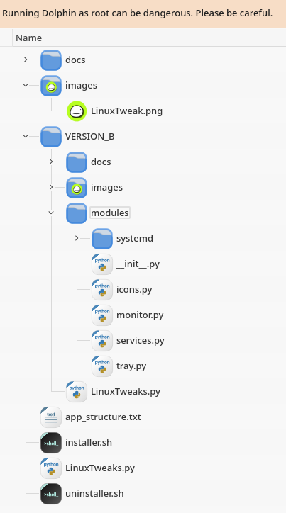

#  Linux Tweaks

# UNDER CONSTRUCTION !!

> *Tolga Erok*

> *17/3/2025*

 # Install and to check for Updates

### *IMPORTANT:*
🔗 *Please run my uninstaller first as I do many modifications and change the structure of the classes the python script reads from:*
 ```bash
curl -sL https://raw.githubusercontent.com/tolgaerok/linuxtweaks/main/MY_PYTHON_APP/uninstaller.sh | sudo bash
```

🔗 *Installer*
 ```bash
 curl -sL https://raw.githubusercontent.com/tolgaerok/linuxtweaks/main/MY_PYTHON_APP/installer.sh | sudo bash
```

### *Or for more convience, copy and paste the following into your terminal and this will create an alias called `linuxtweaks_update`*

```bash
echo "alias linuxtweaks_update='
  echo \"Running uninstaller...\";
  curl -sL https://raw.githubusercontent.com/tolgaerok/linuxtweaks/main/MY_PYTHON_APP/uninstaller.sh | sudo bash;
  echo \"Uninstall complete. Now checking for updates...\";
  curl -sL https://raw.githubusercontent.com/tolgaerok/linuxtweaks/main/MY_PYTHON_APP/installer.sh | sudo bash'" >> ~/.bashrc
source ~/.bashrc
```

### *Close and reopen your terminal and type and then hit enter key:*
```bash
linuxtweaks_update
```

### *Btrfs maintaince*
```bash
echo 'alias scrub="echo -e \"🔍 Running Btrfs Maintenance...\" && \
sudo btrfs scrub start -B / && echo -e \"✅ Scrub completed!\" && \
sudo btrfs balance start -v / && echo -e \"✅ Balance completed!\" && \
sudo fstrim -av && echo -e \"🚀 Trim completed\\!\""' >> ~/.bashrc

source ~/.bashrc

```

 My python linuxtweaks app
 ## Screenshots
            
            
 

## Structure
 

#

Tolga Erok
26-3-2025
Version:    3.0
-----------------------------------------

Change Log

March 27, 2025  
- Initial version of LinuxTweaks installer and uninstaller created  
- Installer checks for dependencies (Python3, PyQt6, Git) and installs them via `dnf` or `pacman`  
- Repository cloned or updated in the temporary directory  
- Application files copied to `/usr/local/bin/LinuxTweaks`, symlink created at `/usr/local/bin/linuxtweaks`  
- Autostart entry added to `~/config/autostart/linuxtweaksdesktop`, desktop shortcut created  
- Uninstaller created to stop the app process and remove application files, symlink, autostart entry, cloned repo, and desktop shortcut  

Failed/Inactive State:  
- Installer failed to properly check and install dependencies on some systems  
- Some users experienced issues with repo cloning due to directory permission errors  
- Symlink creation failed in certain cases where directory paths were not correctly handled  
- Autostart entry and desktop shortcut not created on some systems due to missing user permissions

-----------------------------------------

March 28, 2025  
- Fixed issues with file permissions in the temporary clone directory  
- Improved repo cloning and updating by adding checks for existing repositories  
- Ensured proper cleanup of cloned repository after deployment  
- Adjusted permissions to ensure all copied files are executable  
- Improved directory creation for autostart entries and desktop shortcuts  

Failed/Inactive State:  
- Issues persisted with file permissions in the temporary clone directory, causing installer failures  
- Repository cleanup didn't occur in some cases after the deployment  
- Permissions for the copied files were incorrectly set, causing issues with executable files not running

-----------------------------------------

March 31, 2025  
- Updated script for proper symlink creation of `linuxtweaks` in `/usr/local/bin`  
- Fixed bug where symlink pointed to the wrong location  
- Adjusted system path permissions for automatic execution of `linuxtweaks` via symlink  
- Updated installer script for better directory permissions, avoiding execution errors  
- Fixed issues with desktop shortcut creation and permissions  
- Simplified the uninstaller for a more efficient cleanup process  

Failed/Inactive State:  
- Symlink was not always created correctly, causing execution failures  
- Automatic execution failed due to incorrect system path permissions  
- Autostart entry creation failed in certain desktop environments, leading to the app not starting automatically after installation

-----------------------------------------

April 1, 2025  
- Modified installer to create symlinks and auto-execute the app after installation with a more robust method  
- Added final checks to ensure symlink and autostart entry are created correctly  
- Resolved issues that prevented automatic startup of the Python application after installation  
- Cleaned up redundant code, improving maintainability  

Failed/Inactive State:  
- Symlink creation and auto-execution method was unstable, resulting in inconsistent app launches after installation  
- The uninstaller occasionally left residual files on the system, causing issues when reinstalling  
- Some redundant steps in the installer caused performance issues


 


#

## Main Menu .

| Tweak      | Tested | Pass | Link  |
|------------|:------:|:----:|------------|
| 📡 **CAKE (Protocol)**   |  Yes   | Yes  | [📜 Documentation](https://github.com/tolgaerok/linuxtweaks/blob/main/MY_PYTHON_APP/docs/about-cake.md) |
| 🌐 **FlatPak AutoUpdater**   |  Yes   | Yes  | [📜 Documentation](https://github.com/tolgaerok/linuxtweaks/blob/main/MY_PYTHON_APP/docs/about-flatpak-auto-updater.md) |
| 🏠 **HOST** |  Yes   | Yes  | [TO-DO](#) | 
| 📡 **NSSWITCH** |  Yes   | Yes  | [TO-DO](#) | 
| 📡 **RESOLVED-DNS** |  Yes   | Yes  | [TO-DO](#) | 
| 🖧  **WSSD** |  Yes   | Yes  | [TO-DO](#) | 
| 🖧 **SAMBA** |  Yes   | Yes  | [TO-DO](#) | 
| **a** |  Yes   | Yes  | [TO-DO](#) | 
| **b** |  Yes   | Yes  | [TO-DO](#) | 
| **c** |  Yes   | Yes  | [TO-DO](#) | 
| **d** |  Yes   | Yes  | [TO-DO](#) | 
| **e** |  Yes   | Yes  | [TO-DO](#) | 
| **f** |  Yes   | Yes  | [TO-DO](#) | 


## *Other repositories in my git hub:*

<div align="center">
  <table style="border-collapse: collapse; width: 100%; border: none;">
    <tr>
     <td align="center" style="border: none;">
        <a href="https://github.com/tolgaerok/fedora-tolga">
          
          <br>Fedora
        </a>
      </td>
      <td align="center" style="border: none;">
        <a href="https://github.com/tolgaerok/NixOS-tolga">
          
          <br>NixOs 23.05
        </a>
      </td>
    </tr>
  </table>
</div>

## *My Stats:*

<div align="center">

<div style="text-align: center;">
  <a href="https://git.io/streak-stats" target="_blank">
    
  </a>
  <div style="text-align: center;">
    <a href="https://github.com/anuraghazra/github-readme-stats" target="_blank">
      
    </a>
  </div>
</div>
</div>


#
TEST PURPOSES: [Back to Main Menu](https://github.com/tolgaerok/linuxtweaks/blob/main/README.md)
#


| OS        | Tested           | Pass  |
| ------------- |:-------------:| -----:|
| AURORA | YES      |    Yes |
| BIGLINUX | YES      |    Yes |
| BLUEFIN | YES      |    Yes |
| DEBIAN | YES      |    Yes |
| FEDORA 39 | YES      |   Yes|
| FEDORA 40 | YES      |   Yes|
| FEDORA 41 | YES      |   Yes|
| KUBUNTU | YES      |    Yes |
| NIXOS 23.05  | YES      |    Yes |
| NIXOS 24.05  | YES      |    Yes |
| NIXOS 24.11  | YES      |    Yes |
| NOBARA | YES      |    Yes |
| RHEL      | YES | Yes |
| SOLUS | YES      |    Yes |


