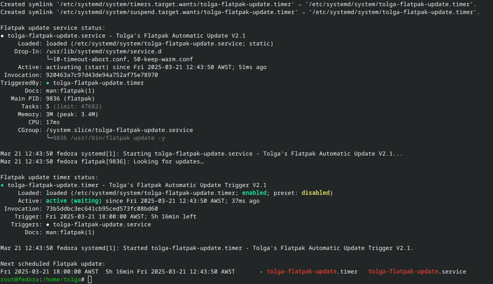

# *`Personal Tweaks
```sh
Tolga Erok
21/3/2025
```
<div align="left">
  <table style="border-collapse: collapse; width: 100%; border: none;">
    <td align="center" style="border: none;">
        <a href="https://www.debian.org">
          
          <br>Debian
        </a>
      </td>
    </tr>
  </table>
</div>

The provided bla bla bla

- BLa Bla

# *Summary*
Overall, bla bla

## *`How to run?`*

1. Make sure `git` is usable. If not, *install it:*

```sh
sudo apt-get install git -y
```

2. Open Terminal, type:

```sh
git clone https://github.com/tolgaerok/Debian-tolga.git
cd ./Debian-tolga
```

3. Run it:

```sh
chmod u+x ./install.sh
./install.sh

or run my online debian updater:
bash -c "$(curl -fsSL https://raw.githubusercontent.com/tolgaerok/Debian-tolga/main/SCRIPTS/DEBIAN-UPDATER.sh)"

```

## *Other repositories in my git hub:*

<div align="center">
  <table style="border-collapse: collapse; width: 100%; border: none;">
    <tr>
     <td align="center" style="border: none;">
        <a href="https://github.com/tolgaerok/fedora-tolga">
          
          <br>Fedora
        </a>
      </td>
      <td align="center" style="border: none;">
        <a href="https://github.com/tolgaerok/NixOS-tolga">
          
          <br>NixOs 23.05
        </a>
      </td>
    </tr>
  </table>
</div>

## *My Stats:*

<div align="center">

<div style="text-align: center;">
  <a href="https://git.io/streak-stats" target="_blank">
    
  </a>
  <div style="text-align: center;">
    <a href="https://github.com/anuraghazra/github-readme-stats" target="_blank">
      
    </a>
  </div>
</div>
</div>


<div align="left">
  <table style="border-collapse: collapse; width: 100%; border: none;">
    <tr> 
      <td align="center" style="border: none;">
        <a href="https://github.com/tolgaerok/linuxtweaks">
          
          <br>LinuxTweaks
        </a>
      </td>
    </tr>
  </table>
</div>


#
🛠️ 🔨 🏗️ 🧰 🖥️ 💻 🧑‍💻 📱 🎮 🖱️ 🔍 🔒 🔑 💾 🖋️ ✍️ 💡 ⚡ 🌐 🌍 🌎 🌏 📡 🔄 🔁 🔃 ⏳ 🕹️ 🎯 🏆 🏅 🏁 🏟️ 🎮 📚 📜 📑 📋 📂 🗂️ 🧾 🗃️ 🧠 🧪 🧬 🧳 🛒 🛍️ 🎉 🧡 💙 💚 💛 🧡 💜 🖤 💔 🤍

Networking & Configuration Icons:
🌐 🖧 🌍 🌎 🌏 📡 📶 🔌 🌐 🔗 🛠️ 🔒 🔑 🔧 🏙️ 🏠 🏢 🚀

Scripts and Coding:
💻 🖥️ ⌨️ 🧑‍💻 🛠️ 💾 📜 📑 📃 🧾 📋 🗂️

Security:
🔒 🔑 🔓 🛡️ 🔏 ⚔️

Tools and Utilities:
🔧 ⚙️ 🧰 🔨 🪛 🧲 🔩 🪜

Server/Hosting:
💾 🖥️ 📡 🔄 🌐 🗄️ 🔌 📶

Communication:
📞 📱 📨 📡 📶 💬 💬 📠

| Kubuntu | Ubuntu | Fedora | Debian | NixOS | Arch Linux | Manjaro |
| ------- | ------ | ------ | ------ | ----- | ---------- | ------- |


TEST PURPOSES: [Back to Main Menu](https://github.com/tolgaerok/linuxtweaks/blob/main/README.md)




<table>
  <tr>
    <td></td>
    <td></td>
    <td></td>
    <td></td>
    <td></td>
    <td></td>
    <td></td>
  </tr>
  <tr>
    <td>Kubuntu</td>
    <td>Ubuntu</td>
    <td>Fedora</td>
    <td>Debian</td>
    <td>NixOS</td>
    <td>Arch Linux</td>
    <td>Manjaro</td>
  </tr>
</table>