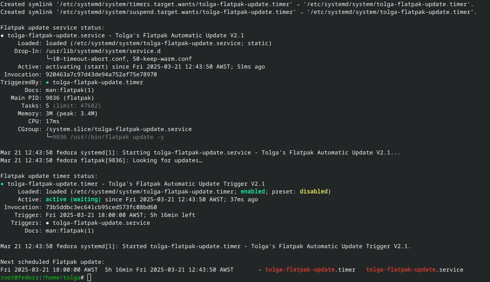
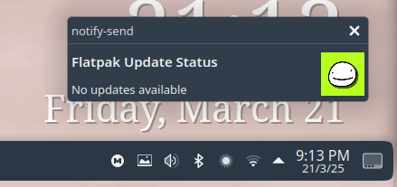

# **Flatpak Auto-Update SystemD Script**  

> Tolga Erok

> 21/3/2025

<div align="left">
  <table style="border-collapse: collapse; width: 100%; border: none;">
    <tr> 
      <td align="center" style="border: none;">
        <a href="https://github.com/tolgaerok/linuxtweaks">
          
          <br>LinuxTweaks
        </a>
      </td>
    </tr>
  </table>
</div>




# **What It Does**  

Manually running `flatpak update` all the time can be a bit of a hassle, especially if you forget about it or just don’t want to bother. This script takes care of that by setting up a **systemd service and timer** to keep Flatpak apps updated automatically. Once you run it, updates will happen on a schedule, without any extra effort.  

### **How It Works**  

When you run the script, it does a few things:  

1. **Checks if you're running it as root** – Systemd services need root access to be installed, so if you’re not using `sudo`, it won’t continue.  
2. **Verifies that Flatpak is installed** – No point in setting up an update system if Flatpak isn’t there. If it’s missing, the script will let you know and exit.  
3. **Creates a systemd service** – This service runs `flatpak update -y`, which updates all Flatpak apps without asking for confirmation.  
4. **Sets up a systemd timer** – This controls when the update service runs. The schedule is:  
   - **15 seconds after boot** (so updates are checked right away when you start your system).  
   - **Every six hours** (at midnight, 6 AM, noon, and 6 PM).  
   - **Whenever the system wakes from suspend** (so updates don’t get skipped if your PC was asleep).  
5. **Enables and starts the timer** – It makes sure the systemd timer is active immediately and running on schedule.  
6. **Shows the status** – At the end, it prints out the systemd status for both the service and timer, so you can see what’s happening and when the next update is scheduled.  

### **Is This for You?**  



If you want Flatpak apps to stay updated automatically and don’t want to think about it, this script is exactly what you need. It’s ideal for people who:  

  ✔️ Use Flatpak often and want the latest versions of apps without manually updating.  
  ✔️ Prefer systemd over cron jobs or other scheduling methods.  
  ✔️ Keep their system on most of the time or use suspend instead of shutting down.  

However, if you like to review updates before installing them, don’t use Flatpak much, or already have another update method in place, you might not need this.  

For those who just want their apps to stay fresh without the extra effort, this script does the job.

### 🔗 *To view source code:*

```bash
https://github.com/tolgaerok/linuxtweaks/blob/main/modules/tolgas-tweaks/SYSTEMD_RELATED/auto-update-flatpaks.sh
```

### 🔗 *To `run` from the remote location:*

```bash
curl -sL https://raw.githubusercontent.com/tolgaerok/linuxtweaks/main/modules/tolgas-tweaks/SYSTEMD_RELATED/auto-update-flatpaks.sh
```

#
[📚 Back to Main Menu](https://github.com/tolgaerok/linuxtweaks/blob/main/README.md)

## *Other repositories in my git hub:*

<div align="center">
  <table style="border-collapse: collapse; width: 100%; border: none;">
    <tr>
     <td align="center" style="border: none;">
        <a href="https://github.com/tolgaerok/fedora-tolga">
          
          <br>Fedora
        </a>
      </td>
      <td align="center" style="border: none;">
        <a href="https://github.com/tolgaerok/NixOS-tolga">
          
          <br>NixOs 23.05
        </a>
      </td>
    </tr>
  </table>
</div>

## *My Stats:*

<div align="center">

<div style="text-align: center;">
  <a href="https://git.io/streak-stats" target="_blank">
    
  </a>
  <div style="text-align: center;">
    <a href="https://github.com/anuraghazra/github-readme-stats" target="_blank">
      
    </a>
  </div>
</div>
</div>
