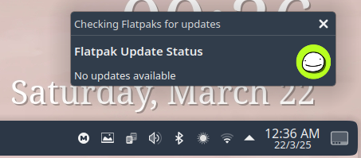

# **Flatpak Auto-Update SystemD Script**  

> Tolga Erok

> 21/3/2025


<p align="center">
  
</p>

<p align="center">
  
</p>

<p align="center">
  <i>For those who just want their apps to stay fresh without the extra effort, this script does the job.</i>
</p>

## Simplifying Updates for You

From my experience, manually checking for Flatpak updates can be tedious, especially if you forget or don’t feel like dealing with it. This script automates the process, saving you time and ensuring your Flatpak apps are always up to date without any `hassle`.
Why Use It?

I believe this script could really help users who prefer a `set-and-forget` method to keep their apps updated. Instead of manually running flatpak update, it handles everything through a simple `systemd service` and `timer`. It checks for updates as soon as your *system boots, every six hours, and when your PC wakes from suspend.*

If you’re like me and appreciate automating routine tasks, you’ll likely find this useful. The script also ensures that updates occur even if your machine was asleep, keeping everything current.
How It Works

-    Checks if Flatpak is installed: Before running anything, the script checks if Flatpak is installed on your system.
-    Creates a `systemd service`: This runs the `flatpak update -y` command to update all your Flatpak apps without asking for confirmation.
-    Sets up a timer: The update process is scheduled to run right after boot, every `six` hours, and after waking up from `suspend`. This means you don’t have to worry about forgetting to check.
-    Enables and starts the timer: It sets everything in motion right away, making sure the updates happen automatically.
-    Displays status: At the end of the process, it shows you the status of both the service and timer, so you know when the next update is coming.

## Who Should Use This?

If you use Flatpak often and like the idea of keeping your apps up to date automatically, this script is a perfect fit. It’s especially helpful if you don’t want to think about updating and prefer using `systemd` over `cron` jobs. 

I feel it’s a solid choice for people who keep their system on all the `time` or use `suspend`.

*However, if you’re someone who prefers reviewing updates before installation or doesn’t use Flatpak much, this may not be necessary for you.*


### 🔗 *To view source code:*

```bash
https://github.com/tolgaerok/linuxtweaks/blob/main/modules/tolgas-tweaks/SYSTEMD_RELATED/auto-update-flatpaks.sh
```

### 🔗 *To `run` from the remote location:*

```bash
curl -sL https://raw.githubusercontent.com/tolgaerok/linuxtweaks/main/modules/tolgas-tweaks/SYSTEMD_RELATED/auto-update-flatpaks.sh
```

#
[📚 Back to Main Menu](https://github.com/tolgaerok/linuxtweaks/blob/main/README.md)

## *Other repositories in my git hub:*

<div align="center">
  <table style="border-collapse: collapse; width: 100%; border: none;">
    <tr>
     <td align="center" style="border: none;">
        <a href="https://github.com/tolgaerok/fedora-tolga">
          
          <br>Fedora
        </a>
      </td>
      <td align="center" style="border: none;">
        <a href="https://github.com/tolgaerok/NixOS-tolga">
          
          <br>NixOs 23.05
        </a>
      </td>
    </tr>
  </table>
</div>

## *My Stats:*

<div align="center">

<div style="text-align: center;">
  <a href="https://git.io/streak-stats" target="_blank">
    
  </a>
  <div style="text-align: center;">
    <a href="https://github.com/anuraghazra/github-readme-stats" target="_blank">
      
    </a>
  </div>
</div>
</div>
